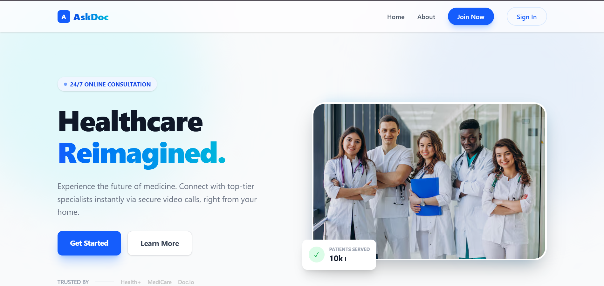
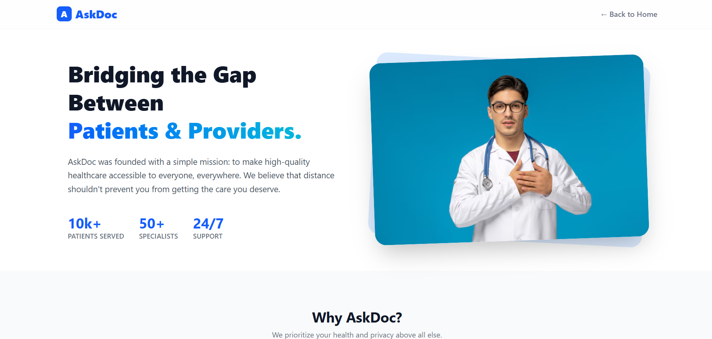
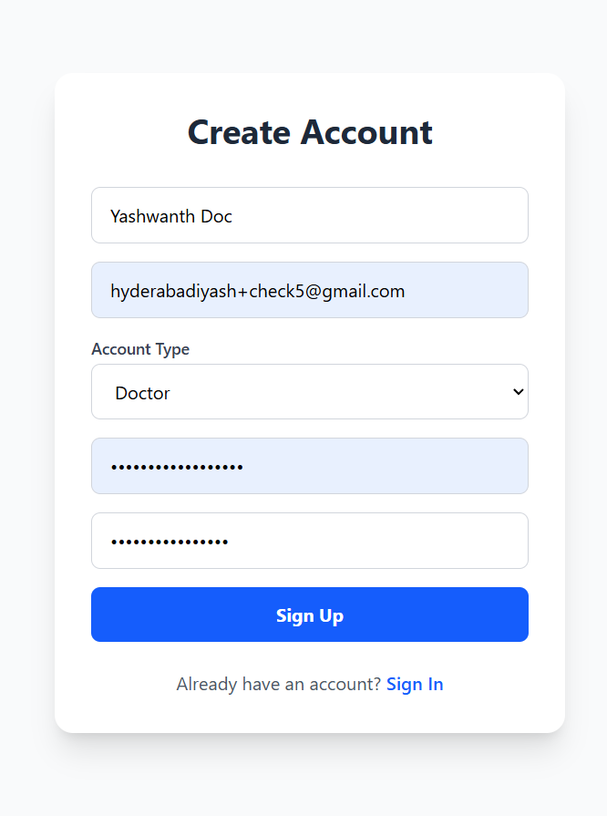
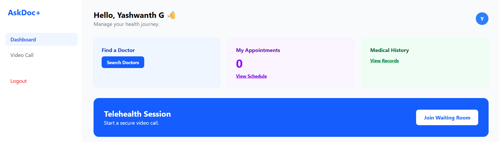
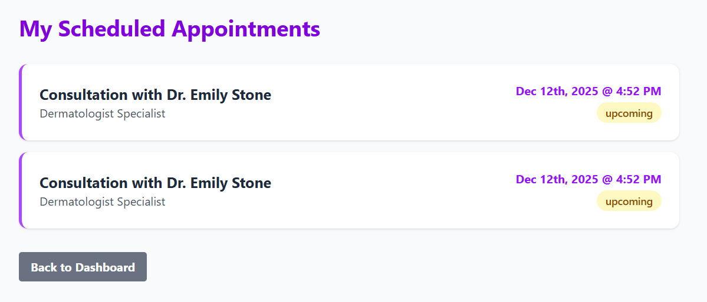
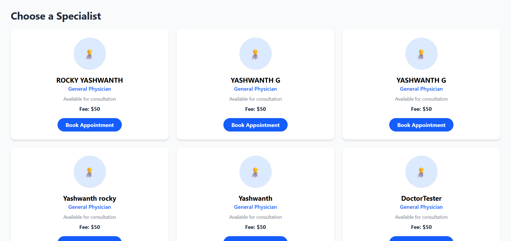
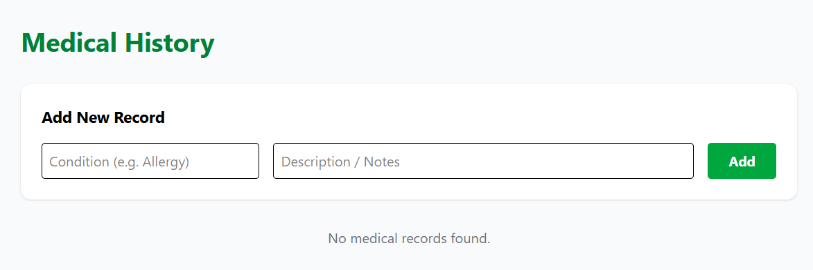
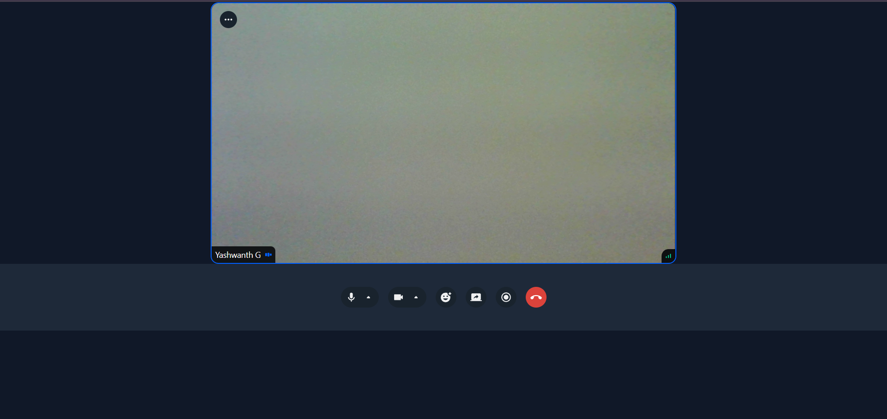
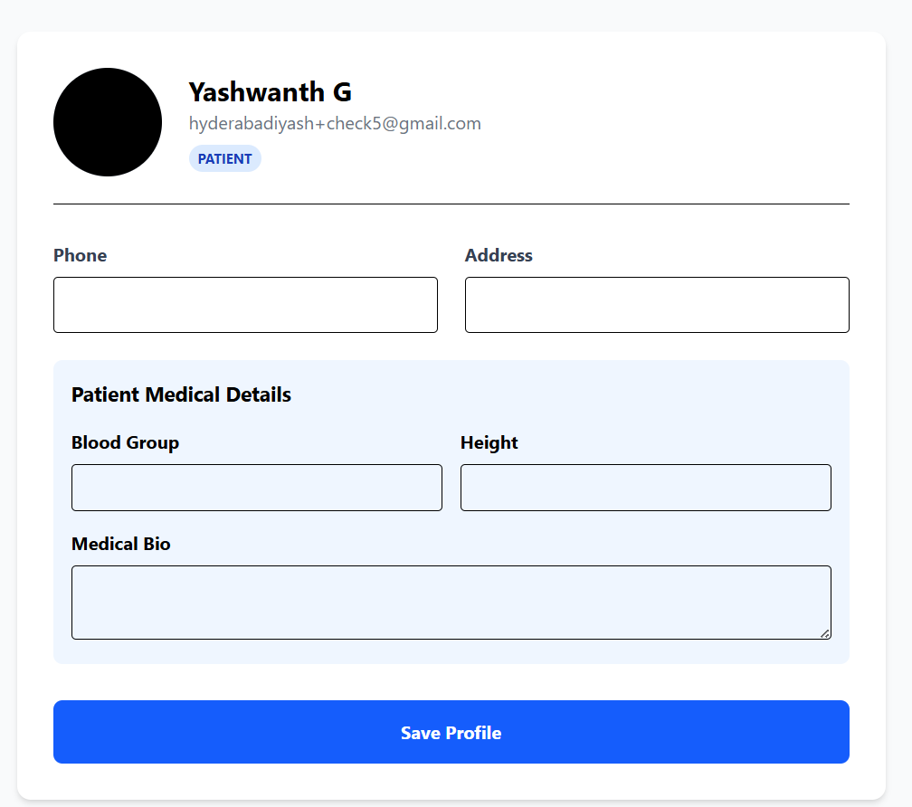
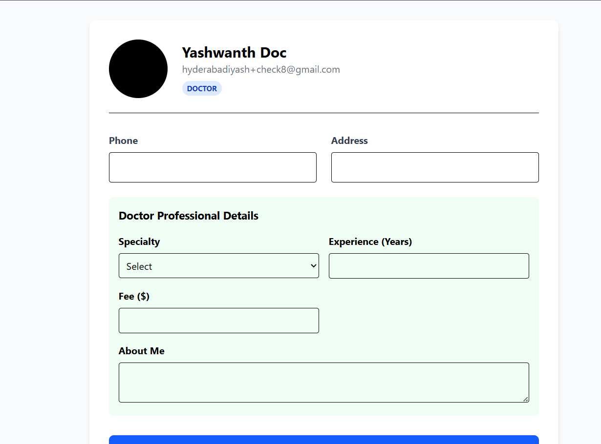

# 🩺 AskDoc+ Telehealth Platform

## 1. Problem Statement

Access to specialized healthcare is often limited by geography, time constraints, and cost. Traditional appointment scheduling is cumbersome, and sensitive patient data is often fragmented. The core problem is the **lack of a unified, secure, and immediate platform** that centralizes patient data and connects patients directly with verified specialists via live video.

## 2. Solution: AskDoc+

AskDoc+ is a full-stack, secure, role-based telehealth platform designed to bridge the gap between patients and providers. It offers a singular, comprehensive solution for medical record management, appointment booking, and instant virtual consultations, demonstrating mastery of the MERN stack and real-time communication protocols.

---

## 3. Key Features

| Feature | Description | Status |
| :--- | :--- | :--- |
| **Role-Based Access Control** | Separate dynamic dashboards for **Patients** and **Doctors**, ensuring data security and proper access. | ✅ Implemented |
| **Secure Authentication** | User signup, login, and robust email-based **OTP verification** for new accounts. | ✅ Implemented |
| **Real-time Video Call** | Integrated **Stream Video SDK** for secure, low-latency, peer-to-peer virtual consultations. | ✅ Implemented |
| **Dynamic Profile Management** | Users can update personal details, and Doctors can set their **Specialty, Fee, and Experience**. | ✅ Implemented |
| **Appointment System** | Patients can view a directory of doctors and book appointments; both parties see scheduled meetings. | ✅ Implemented |
| **Photo Handling** | User profile pictures are handled and stored securely via **Base64 encoding**. | ✅ Implemented |

---

## 4. Technical Stack & Deployment

| Component | Technology | Live URL |
| :--- | :--- | :--- |
| **Frontend** | React, Vite, Tailwind CSS | [https://askdoc-telehealth.vercel.app/] |
| **Backend** | Node.js, Express.js | [https://askdoc-telehealth.onrender.com] |
| **Database** | MongoDB Atlas | Cloud-Hosted |
| **WebRTC/Video**| Stream Chat/Video SDK | External API |

## 5. Visual Proof of Functionality

### 5.1 Homepage & Core Navigation

### 5.2 About Us Page

### 5.3 Sign Up Page

### 5.4 Login Page

### 5.5 Patient Dashboard page

### 5.6 Appointments page

### 5.7 Find Doctors page

### 5.8 Medical history page

### 5.9 Video Call portal 
**CRITICAL FEATURE:** This proves your Stream integration is live!

### 5.10 Patient Profile

### 5.11 Doctor Dashboard

### 5.12 Doctor profile

## 6. Setup and Installation Guide
1.  **Clone the repository:** `git clone [https://github.com/YASHWANTHGUNA/askdoc-telehealth]`
2.  **Install Dependencies:** Run `npm install` in both the `backend` and `frontend` directories.
3.  **Environment Variables:**
    * **Backend (Render):** Requires `STREAM_API_KEY`, `STREAM_API_SECRET`, and `DATABASE`.
    * **Frontend (Vercel):** Requires `VITE_STREAM_API_KEY` and `VITE_API_URL` (pointing to the Render backend).

## 7. Project Maintainer

**[G.YASHWANTH]**
* **GitHub:** [https://github.com/YASHWANTHGUNA]
* **LinkedIn:** [https://www.linkedin.com/in/yashwanth-guna-b61099292/]
