# 🩺 AskDoc+ Telehealth Platform

## 1. Problem Statement

Access to specialized healthcare is often limited by geography, time constraints, and cost. Traditional appointment scheduling is cumbersome, and sensitive patient data is often fragmented. The core problem is the **lack of a unified, secure, and immediate platform** that centralizes patient data and connects patients directly with verified specialists via live video.

## 2. Solution: AskDoc+

AskDoc+ is a full-stack, secure, role-based telehealth platform designed to bridge the gap between patients and providers. It offers a singular, comprehensive solution for medical record management, appointment booking, and instant virtual consultations, demonstrating mastery of the MERN stack and real-time communication protocols.

---

## 3. Key Features

| Feature | Description | Status |
| :--- | :--- | :--- |
| **Role-Based Access Control** | Separate dynamic dashboards for **Patients** and **Doctors**, ensuring data security and proper access. | ✅ Implemented |
| **Secure Authentication** | User signup, login, and robust email-based **OTP verification** for new accounts. | ✅ Implemented |
| **Real-time Video Call** | Integrated **Stream Video SDK** for secure, low-latency, peer-to-peer virtual consultations. | ✅ Implemented |
| **Dynamic Profile Management** | Users can update personal details, and Doctors can set their **Specialty, Fee, and Experience**. | ✅ Implemented |
| **Appointment System** | Patients can view a directory of doctors and book appointments; both parties see scheduled meetings. | ✅ Implemented |
| **Photo Handling** | User profile pictures are handled and stored securely via **Base64 encoding**. | ✅ Implemented |

---

## 4. Technical Stack & Deployment

| Component | Technology | Live URL |
| :--- | :--- | :--- |
| **Frontend** | React, Vite, Tailwind CSS | [https://askdoc-telehealth.vercel.app/] |
| **Backend** | Node.js, Express.js | [https://askdoc-telehealth.onrender.com] |
| **Database** | MongoDB Atlas | Cloud-Hosted |
| **WebRTC/Video**| Stream Chat/Video SDK | External API |

## 5. Visual Proof of Functionality

### 5.1 Homepage & Core Navigation
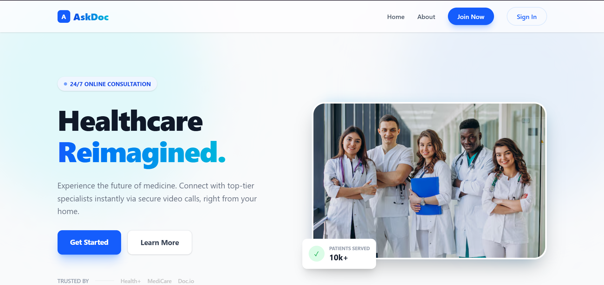

### 5.2 About Us Page
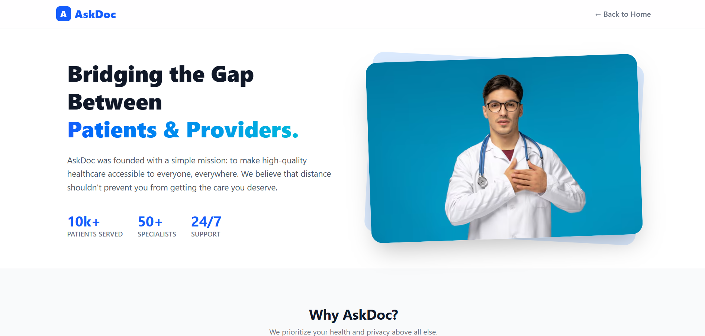

### 5.3 Sign Up Page
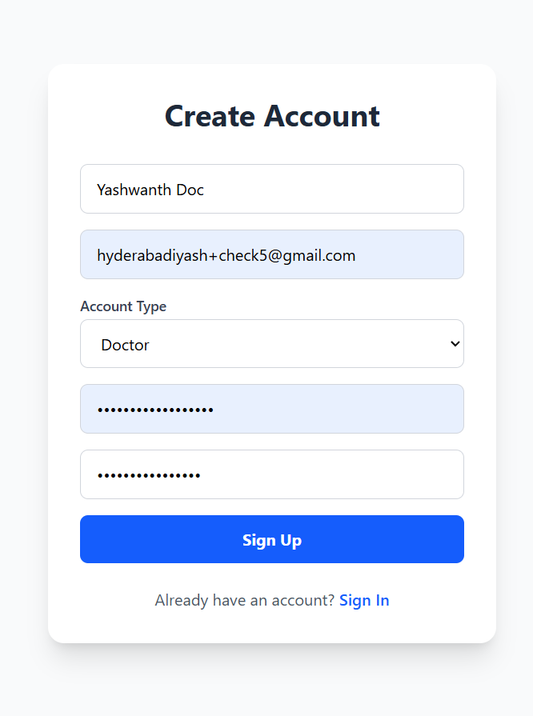

### 5.4 Login Page
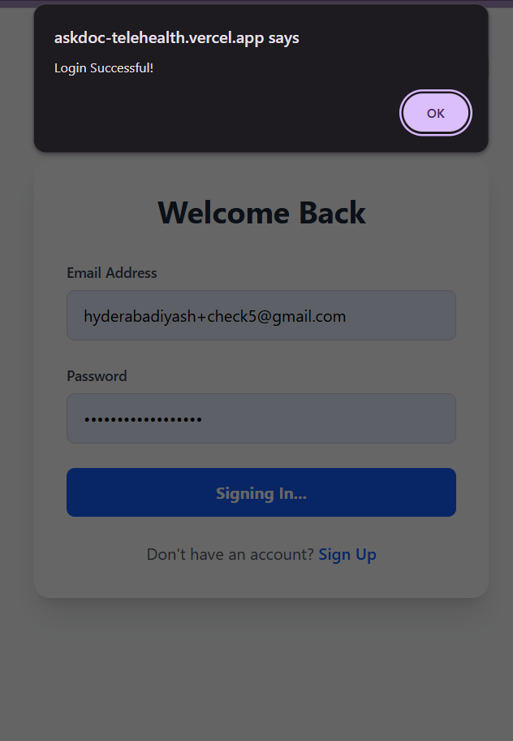

### 5.5 Patient Dashboard page
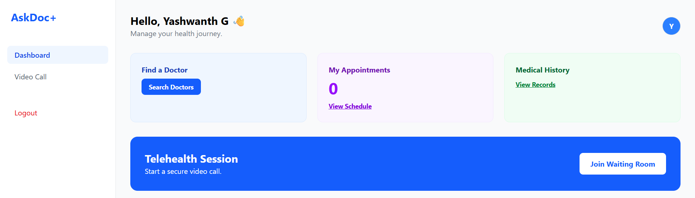

### 5.6 Appointments page
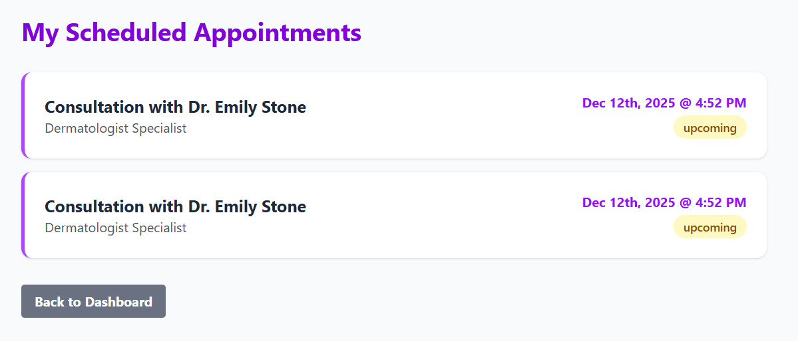

### 5.7 Find Doctors page
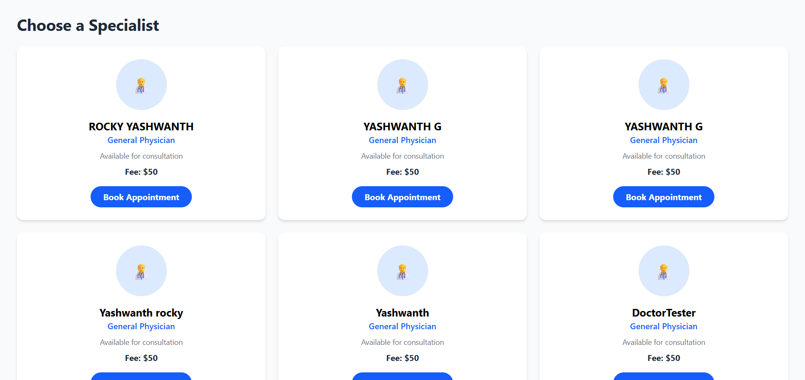

### 5.8 Medical history page
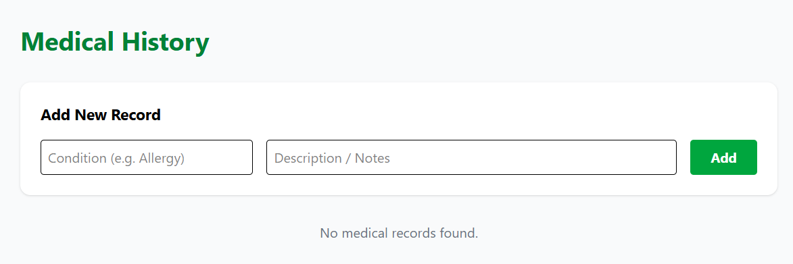

### 5.9 Video Call portal 
**CRITICAL FEATURE:** This proves your Stream integration is live!
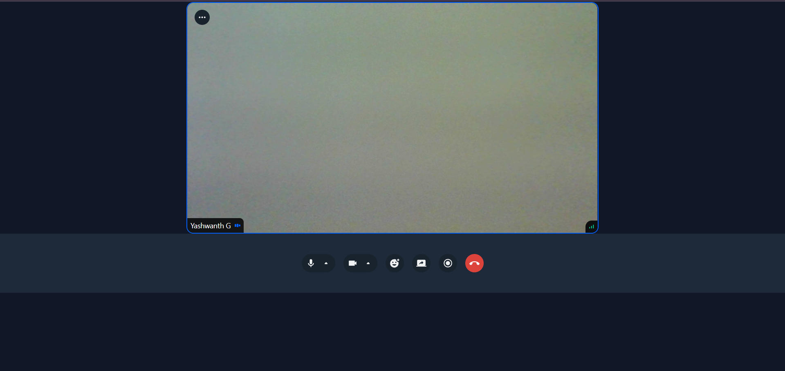

### 5.10 Patient Profile
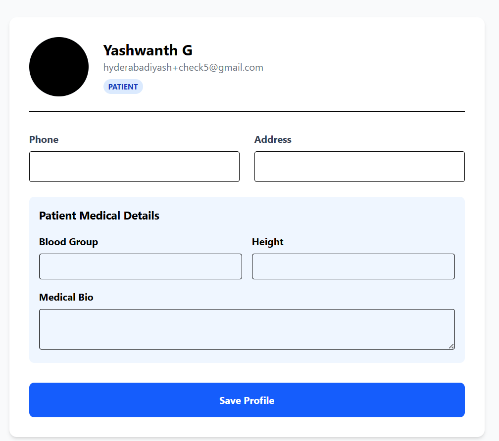

### 5.11 Doctor Dashboard
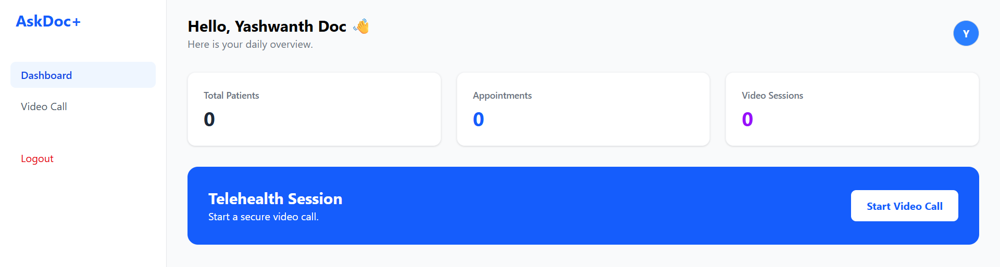

### 5.12 Doctor profile
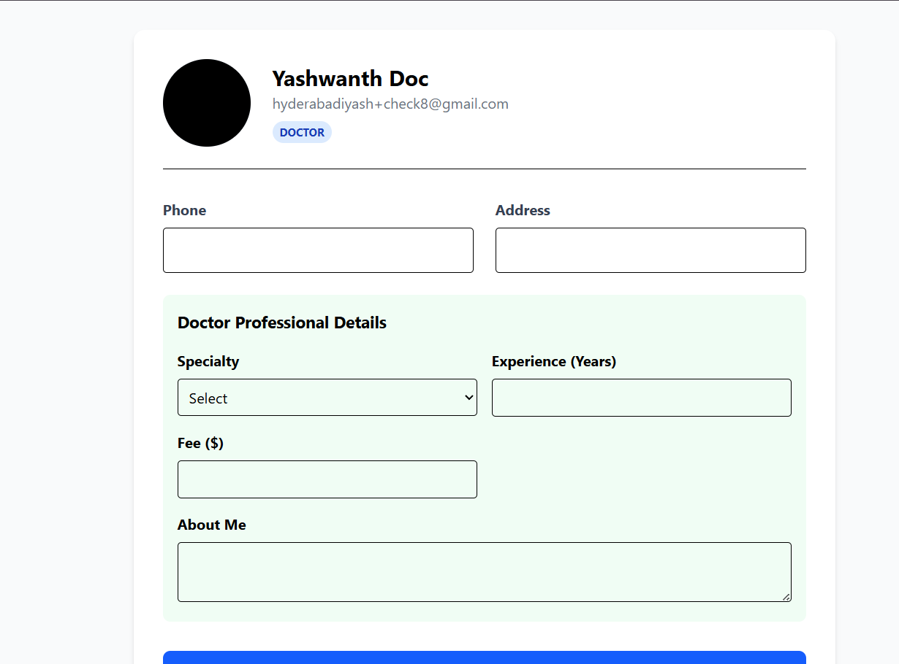

| Patient Experience | Clinical Workspace |
| :---: | :---: |
| 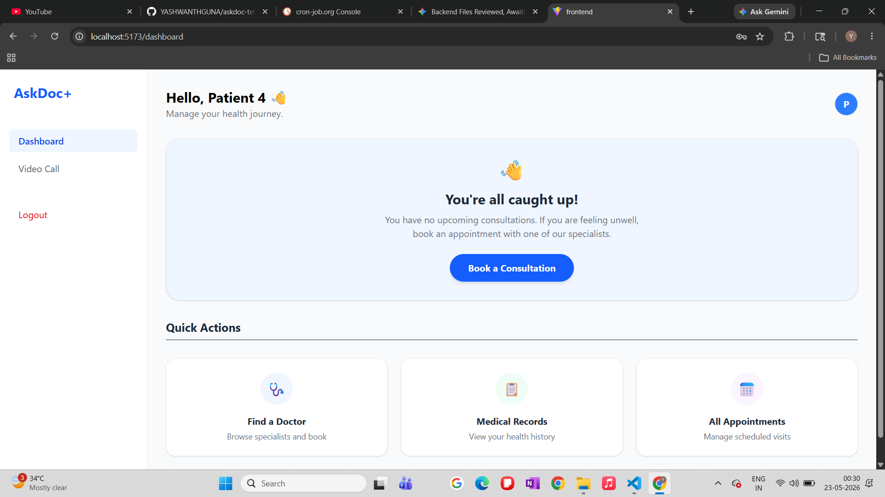 | 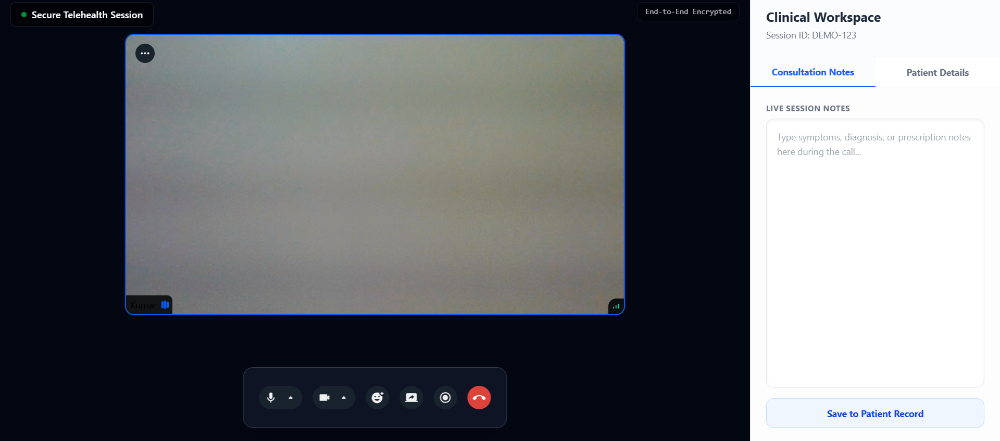 |
| *Action-oriented command center with dynamic state UI for upcoming appointments.* | *Secure WebRTC video room with integrated, debounced EMR auto-saving.* |
| 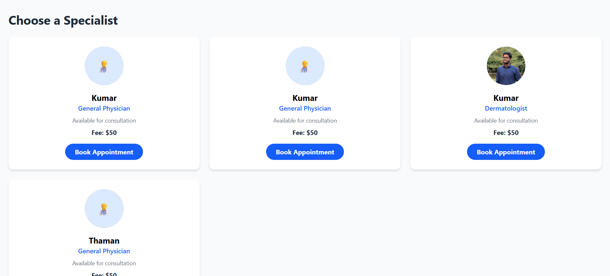 | 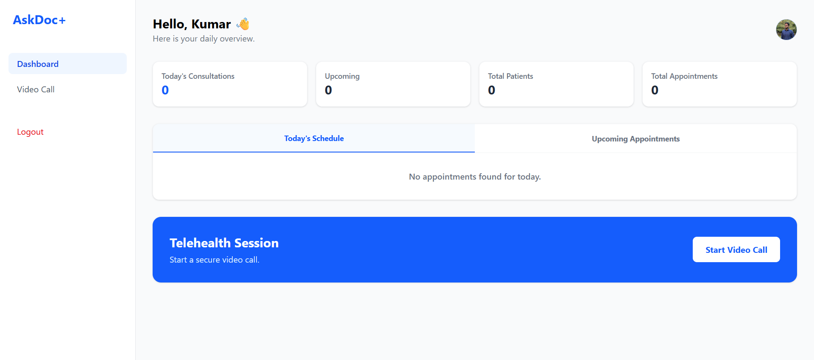 |
| *Smart doctor discovery with client-side modal rendering for frictionless UX.* | *Chronological schedule flow with instant, asynchronous state updates.* |

## 🏗️ Part I: Architectural Decisions & Technical Approach

### 1. The Stack: MERN (MongoDB, Express, React, Node.js)
The MERN stack was chosen for its non-blocking, event-driven architecture, which is critical for a real-time application like telehealth. Using JavaScript across the entire stack allowed for seamless data serialization between the MongoDB BSON documents and the React frontend state.

### 2. Video Infrastructure: Stream Video SDK vs. Raw WebRTC
Building raw WebRTC requires managing STUN/TURN servers for NAT traversal and building complex signaling servers via WebSockets. 
* **Decision:** I integrated the **Stream Video SDK** to abstract the infrastructure layer. This allowed me to focus on the business logic—generating secure, time-sensitive JWTs on my Node.js backend to authenticate users into isolated, end-to-end encrypted video rooms on the client side.

### 3. Authentication & Security Layer
* **Stateless Auth:** Implemented JSON Web Tokens (JWT) stored securely on the client, eliminating the need for server-side session storage and allowing the API to remain perfectly RESTful and horizontally scalable.
* **Cryptographic Security:** Enforced a `bcrypt` work factor of 12 for password hashing. While this adds ~300ms of compute time per login, it drastically hardens the system against brute-force attacks.
* **Transactional Email (Resend):** Utilized Resend API for delivering 6-digit OTPs during account creation to verify user identity before database insertion.

### 4. Data Handling & Derived State
* **Multipart Form Data:** Integrated `multer` and the **Cloudinary API** to handle image streams securely, piping file uploads directly to the cloud and storing only the optimized URL strings in MongoDB.
* **Derived Frontend State:** Instead of storing highly mutable data (like a patient's age) in the database, the backend stores a strict ISO Date of Birth. The React frontend computes the exact age on the fly during component rendering, maintaining database normalization.

---

## 🧠 Part II: Core Engineering Implementations

### Role-Based Access Control (RBAC) & Middleware
Designed strict middleware patterns (`isAuthenticated`, `restrictTo`) in Express.js. The routing flow explicitly isolates Doctor and Patient contexts. A patient attempting to hit a doctor-only API endpoint is intercepted at the middleware layer, preventing unauthorized controller execution.

### The Debounced EMR Auto-Save
**The Problem:** EMR (Electronic Medical Record) systems cannot rely on manual "Save" buttons during live video calls; dropped connections result in lost clinical data. 
**The Solution:** Engineered a custom `useEffect` hook in the React video workspace. 
* Implemented a `setTimeout` debouncer that tracks keystrokes.
* It automatically triggers an asynchronous `PATCH` request to the backend exactly 2,000 milliseconds after the doctor stops typing. 
* Result: Zero lost data, zero unnecessary database spamming, and a frictionless UX.

### Optimistic UI Updates
For actions like marking an appointment as "Completed" on the Doctor Dashboard, the React state is updated instantly (optimistic UI), while the `PATCH` request happens asynchronously in the background. This avoids full-page reloads and provides a snappy, production-grade feel.

---

## 🔧 Part III: Engineering Challenge Log & Resolutions

Building a full-stack application involves navigating complex bottlenecks. Below is a log of critical issues encountered and how they were resolved.

### Issue 1: Synchronous API Bottlenecks (The 5+ Second Signup)
* **Symptom:** During local testing, the signup route took over 5 seconds to respond, creating an unacceptable user experience.
* **Root Cause:** The Node.js controller was using `await` on the Resend API email trigger. The server was blocked, waiting for the HTTP round-trip to the email provider before sending the success response to the client.
* **Resolution:** Converted the email trigger into a "fire-and-forget" Promise. By removing the `await` and attaching a `.catch()` for error logging, the server hands the email task to the background and instantly responds to the client. **Latency dropped from >5000ms to <800ms.**

### Issue 2: Free-Tier Cloud Infrastructure "Cold Starts"
* **Symptom:** Deployed production environments experienced 10-15 second delays on the first interaction after a period of inactivity, throwing `503 Service Unavailable` errors during automated checks.
* **Root Cause:** Containerized cloud hosting platforms (like Render) spin down inactive instances to conserve resources. Booting the Node.js environment and establishing the MongoDB TCP connection caused the delay.
* **Resolution:** Implemented a dedicated health-check route (`GET /`) and configured an external Cron Job to ping the server every 10 minutes. This 10-minute interval safely undercuts the platform's 15-minute sleep cycle, ensuring the server remains permanently "warm" and responsive for users.

### Issue 3: Missing Cloud Environment Variables Crashing Deployments
* **Symptom:** The deployed backend instantly crashed on boot, throwing `process.exit(1)`.
* **Root Cause:** The local `config.env` file was correctly secured via `.gitignore`, meaning the deployment pipeline had no access to the MongoDB connection string, causing the safety checks in `server.js` to kill the process.
* **Resolution:** Injected the environment variables (`DB`, `JWT_SECRET`, `RESEND_API_KEY`, etc.) directly into the cloud provider's dashboard, aligning the production environment with the local configuration.

### Issue 4: JSX Build Failures
* **Symptom:** Vite build failed with Babel throwing an "Expecting Unicode escape sequence" error.
* **Root Cause:** Unnecessary backslashes (`\`) were used to escape quotation marks inside standard JSX `className` strings, confusing the Babel compiler.
* **Resolution:** Audited the component trees and sanitized the JSX string formatting, resulting in clean, hot-reloading builds.

---2. Environment Configuration
Backend (backend/config.env):

Code snippet
PORT=8000
DB=your_mongodb_connection_string
JWT_SECRET=your_super_secret_jwt_key
JWT_EXPIRES_IN=30d
RESEND_API_KEY=your_resend_api_key
STREAM_API_KEY=your_stream_api_key
STREAM_API_SECRET=your_stream_api_secret
Frontend (frontend/.env):

Code snippet
VITE_STREAM_API_KEY=your_stream_api_key
VITE_API_URL=http://localhost:8000/api/v1

## 6. Setup and Installation Guide
1.  **Clone the repository:** `git clone [https://github.com/YASHWANTHGUNA/askdoc-telehealth]`
2.  **Install Dependencies:** Run `npm install` in both the `backend` and `frontend` directories.
3.  **Environment Variables:**
    * **Backend (Render):** Requires `STREAM_API_KEY`, `STREAM_API_SECRET`, and `DATABASE`.
    * **Frontend (Vercel):** Requires `VITE_STREAM_API_KEY` and `VITE_API_URL` (pointing to the Render backend).

## 7. Project Maintainer

**[G.YASHWANTH]**
* **GitHub:** [https://github.com/YASHWANTHGUNA]
* **LinkedIn:** [https://www.linkedin.com/in/yashwanth-guna-b61099292/]
